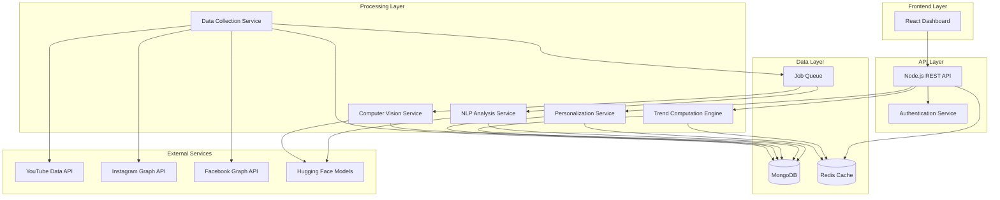

# Design Document: Social Media Trend Analyzer

## Overview

The Social Media Trend Analyzer is a multi-tier AI-driven platform that collects, analyzes, and synthesizes social media content to identify emerging trends and provide personalized insights to content creators. The system architecture follows a microservices pattern with distinct components for data collection, AI analysis, trend computation, and user-facing services.

The platform operates on a continuous data pipeline: content is collected from social media APIs, processed through NLP and computer vision models, aggregated into trends, and personalized for individual creators. The system is designed for horizontal scalability, fault tolerance, and real-time responsiveness.

### Key Design Principles

1. **Separation of Concerns**: Data collection, AI processing, trend analysis, and presentation are independent services
2. **Asynchronous Processing**: Heavy AI workloads run asynchronously to maintain API responsiveness
3. **Caching Strategy**: Frequently accessed trends and insights are cached to reduce computation
4. **Graceful Degradation**: System continues operating even when individual components fail
5. **Data-Driven Personalization**: Creator profiles and historical data drive recommendation algorithms

## Architecture



### Architecture Components

1. **Frontend Layer**: React.js single-page application providing dashboard and visualization
2. **API Layer**: Node.js Express server handling HTTP requests, authentication, and business logic
3. **Processing Layer**: Background workers for data collection, AI analysis, and trend computation
4. **Data Layer**: MongoDB for persistent storage, Redis for caching, message queue for async jobs
5. **External Services**: Third-party APIs and AI models

## Components and Interfaces

### 1. Data Collection Service

**Responsibility**: Retrieve content from social media platforms and queue for processing

**Key Functions**:
- `collectYouTubeContent(query, maxResults)`: Fetches videos matching search criteria
- `collectInstagramContent(hashtags, maxResults)`: Fetches posts by hashtags
- `collectFacebookContent(pages, maxResults)`: Fetches posts from public pages
- `extractEngagementMetrics(rawContent)`: Normalizes metrics across platforms
- `queueForProcessing(contentItem)`: Adds content to processing queue

**Interfaces**:
```typescript
interface ContentItem {
  id: string;
  platform: 'youtube' | 'instagram' | 'facebook';
  type: 'video' | 'image' | 'post';
  title: string;
  description: string;
  author: string;
  publishedAt: Date;
  thumbnailUrl?: string;
  videoUrl?: string;
  engagementMetrics: EngagementMetrics;
  rawData: any;
}

interface EngagementMetrics {
  views: number;
  likes: number;
  comments: number;
  shares: number;
  engagementRate: number;
  timestamp: Date;
}
```

**Error Handling**:
- API rate limits: Implement exponential backoff with jitter
- Network failures: Retry up to 3 times before logging failure
- Invalid responses: Log and skip malformed content

### 2. NLP Analysis Service

**Responsibility**: Process text content to extract topics, themes, sentiment, and embeddings

**Key Functions**:
- `generateEmbeddings(text)`: Creates vector embeddings using Hugging Face sentence transformers
- `extractTopics(text)`: Identifies key topics using keyword extraction
- `analyzeSentiment(text)`: Classifies sentiment as positive, negative, or neutral
- `summarizeText(text, maxLength)`: Generates concise summaries for long content
- `clusterContentByTheme(embeddings)`: Groups similar content using cosine similarity

**Interfaces**:
```typescript
interface NLPAnalysis {
  contentId: string;
  embedding: number[]; // 384-dimensional vector
  topics: string[];
  sentiment: 'positive' | 'negative' | 'neutral';
  sentimentScore: number; // -1 to 1
  summary?: string;
  processedAt: Date;
}

interface ContentTheme {
  id: string;
  name: string;
  keywords: string[];
  centroidEmbedding: number[];
  contentIds: string[];
  averageSentiment: number;
}
```

**Model Configuration**:
- Embedding Model: `sentence-transformers/all-MiniLM-L6-v2` (384 dimensions)
- Sentiment Model: `distilbert-base-uncased-finetuned-sst-2-english`
- Summarization Model: `facebook/bart-large-cnn`

**Performance Optimization**:
- Batch processing: Process up to 32 items simultaneously
- GPU utilization: Use CUDA when available, fallback to CPU
- Caching: Store embeddings to avoid recomputation

### 3. Computer Vision Service

**Responsibility**: Analyze visual content to extract features, objects, and visual themes

**Key Functions**:
- `extractVisualFeatures(imageUrl)`: Generates feature vectors from images
- `sampleVideoFrames(videoUrl, interval)`: Extracts key frames from videos
- `identifyObjects(imageUrl)`: Detects objects and scenes
- `extractColorPalette(imageUrl)`: Identifies dominant colors
- `analyzeComposition(imageUrl)`: Evaluates visual layout and composition

**Interfaces**:
```typescript
interface VisualAnalysis {
  contentId: string;
  featureVector: number[]; // 512-dimensional vector
  objects: DetectedObject[];
  colorPalette: string[]; // Hex color codes
  composition: CompositionMetrics;
  processedAt: Date;
}

interface DetectedObject {
  label: string;
  confidence: number;
  boundingBox?: BoundingBox;
}

interface CompositionMetrics {
  brightness: number;
  contrast: number;
  colorfulness: number;
  complexity: number;
}
```

**Model Configuration**:
- Feature Extraction: `google/vit-base-patch16-224` (Vision Transformer)
- Object Detection: `facebook/detr-resnet-50`
- Frame sampling rate: 1 frame per 5 seconds for videos

### 4. Trend Computation Engine

**Responsibility**: Identify trends, calculate trend scores, and track trend evolution

**Key Functions**:
- `calculateTrendScore(theme, timeWindow)`: Computes trend strength based on engagement velocity
- `identifyEmergingTrends(themes, threshold)`: Flags themes with rapid growth
- `groupRelatedThemes(themes)`: Merges similar themes into unified trends
- `trackTrendEvolution(trendId)`: Monitors trend trajectory over time
- `classifyTrendStatus(trend)`: Marks trends as emerging, peak, or declining

**Interfaces**:
```typescript
interface Trend {
  id: string;
  name: string;
  description: string;
  themes: ContentTheme[];
  trendScore: number; // 0-100
  velocity: number; // Rate of change
  status: 'emerging' | 'peak' | 'declining';
  platforms: string[];
  exampleContent: string[]; // ContentItem IDs
  engagementStats: TrendEngagementStats;
  firstDetected: Date;
  lastUpdated: Date;
}

interface TrendEngagementStats {
  totalViews: number;
  totalLikes: number;
  totalComments: number;
  totalShares: number;
  averageEngagementRate: number;
  contentCount: number;
  growthRate: number; // Percentage change over 7 days
}
```

**Trend Score Calculation**:
```
TrendScore = (0.4 × EngagementVelocity) + (0.3 × ContentVolume) + (0.2 × Recency) + (0.1 × CrossPlatformPresence)

Where:
- EngagementVelocity: Rate of engagement growth (normalized 0-100)
- ContentVolume: Number of content items (normalized 0-100)
- Recency: Time decay factor (more recent = higher score)
- CrossPlatformPresence: Bonus for appearing on multiple platforms
```

**Update Frequency**: Trend scores recalculated every 6 hours

### 5. Personalization Service

**Responsibility**: Generate personalized insights and recommendations for creators

**Key Functions**:
- `buildCreatorProfile(creatorId)`: Analyzes creator's historical content and niche
- `calculateRelevanceScore(trend, creatorProfile)`: Measures trend-creator alignment
- `generatePersonalizedInsights(creatorId)`: Creates ranked list of relevant trends
- `suggestContentIdeas(trend, creatorProfile)`: Provides actionable content suggestions
- `analyzeCreatorPerformance(creatorId)`: Compares creator content with trends

**Interfaces**:
```typescript
interface CreatorProfile {
  id: string;
  userId: string;
  niche: string[];
  targetAudience: string;
  contentEmbeddings: number[][]; // Historical content embeddings
  preferredPlatforms: string[];
  averageEngagement: number;
  createdAt: Date;
  updatedAt: Date;
}

interface PersonalizedInsight {
  trendId: string;
  trend: Trend;
  relevanceScore: number; // 0-100
  reasoning: string;
  contentSuggestions: string[];
  estimatedImpact: 'high' | 'medium' | 'low';
  exampleContent: ContentItem[];
}
```

**Relevance Score Calculation**:
```
RelevanceScore = (0.5 × EmbeddingSimilarity) + (0.3 × NicheAlignment) + (0.2 × PlatformMatch)

Where:
- EmbeddingSimilarity: Cosine similarity between creator and trend embeddings
- NicheAlignment: Overlap between creator niche and trend themes
- PlatformMatch: Bonus if trend is strong on creator's preferred platforms
```

### 6. Predictive Analytics Service

**Responsibility**: Forecast trend trajectories and identify future opportunities

**Key Functions**:
- `predictTrendTrajectory(trendId, days)`: Forecasts trend score for next N days
- `identifySeasonalPatterns(trendHistory)`: Detects cyclical trends
- `calculateConfidenceInterval(prediction)`: Estimates prediction uncertainty
- `flagHighOpportunityTrends(predictions)`: Identifies trends with high growth potential

**Interfaces**:
```typescript
interface TrendPrediction {
  trendId: string;
  predictions: DailyPrediction[];
  seasonalPattern?: SeasonalPattern;
  confidence: number; // 0-1
  generatedAt: Date;
}

interface DailyPrediction {
  date: Date;
  predictedScore: number;
  lowerBound: number;
  upperBound: number;
}

interface SeasonalPattern {
  period: number; // Days
  amplitude: number;
  phase: number;
}
```

**Prediction Method**:
- Time series analysis using exponential smoothing
- Minimum 30 days of historical data required
- Confidence decreases with prediction horizon

### 7. Authentication Service

**Responsibility**: Handle user authentication and OAuth flows for social media platforms

**Key Functions**:
- `authenticateUser(email, password)`: Validates user credentials
- `initiateOAuth(platform, userId)`: Starts OAuth flow for social media connection
- `handleOAuthCallback(code, state)`: Processes OAuth authorization code
- `refreshAccessToken(userId, platform)`: Renews expired tokens
- `validateToken(token)`: Verifies JWT token validity

**Interfaces**:
```typescript
interface User {
  id: string;
  email: string;
  passwordHash: string;
  createdAt: Date;
  lastLogin: Date;
}

interface SocialMediaConnection {
  userId: string;
  platform: 'youtube' | 'instagram' | 'facebook';
  accessToken: string; // Encrypted
  refreshToken: string; // Encrypted
  expiresAt: Date;
  scopes: string[];
  connectedAt: Date;
}
```

**Security Measures**:
- Passwords hashed with bcrypt (cost factor 12)
- Tokens encrypted with AES-256
- JWT tokens expire after 24 hours
- Refresh tokens rotated on use

### 8. API Service

**Responsibility**: Expose REST endpoints for frontend and external integrations

**Key Endpoints**:

```
POST   /api/auth/login
POST   /api/auth/register
POST   /api/auth/oauth/:platform/initiate
GET    /api/auth/oauth/:platform/callback

GET    /api/trends
GET    /api/trends/:id
GET    /api/trends/search?query=:query

GET    /api/insights/personalized
GET    /api/insights/predictions

POST   /api/creator/profile
GET    /api/creator/profile
PUT    /api/creator/profile
GET    /api/creator/performance

POST   /api/collection/trigger
GET    /api/collection/status
```

**Response Format**:
```typescript
interface APIResponse<T> {
  success: boolean;
  data?: T;
  error?: {
    code: string;
    message: string;
  };
  metadata?: {
    timestamp: Date;
    requestId: string;
  };
}
```

## Data Models

### MongoDB Collections

#### 1. content_items
```typescript
{
  _id: ObjectId,
  platform: string,
  externalId: string, // Platform-specific ID
  type: string,
  title: string,
  description: string,
  author: string,
  publishedAt: Date,
  thumbnailUrl: string,
  videoUrl: string,
  engagementMetrics: {
    views: number,
    likes: number,
    comments: number,
    shares: number,
    engagementRate: number,
    timestamp: Date
  },
  nlpAnalysis: {
    embedding: [number],
    topics: [string],
    sentiment: string,
    sentimentScore: number,
    summary: string,
    processedAt: Date
  },
  visualAnalysis: {
    featureVector: [number],
    objects: [{label: string, confidence: number}],
    colorPalette: [string],
    composition: object,
    processedAt: Date
  },
  collectedAt: Date,
  updatedAt: Date
}
```

**Indexes**:
- `{platform: 1, externalId: 1}` (unique)
- `{publishedAt: -1}`
- `{"nlpAnalysis.topics": 1}`
- `{collectedAt: -1}`

#### 2. trends
```typescript
{
  _id: ObjectId,
  name: string,
  description: string,
  themeIds: [ObjectId],
  trendScore: number,
  velocity: number,
  status: string,
  platforms: [string],
  exampleContentIds: [ObjectId],
  engagementStats: {
    totalViews: number,
    totalLikes: number,
    totalComments: number,
    totalShares: number,
    averageEngagementRate: number,
    contentCount: number,
    growthRate: number
  },
  scoreHistory: [{
    date: Date,
    score: number,
    velocity: number
  }],
  firstDetected: Date,
  lastUpdated: Date
}
```

**Indexes**:
- `{trendScore: -1, lastUpdated: -1}`
- `{status: 1, trendScore: -1}`
- `{platforms: 1}`

#### 3. content_themes
```typescript
{
  _id: ObjectId,
  name: string,
  keywords: [string],
  centroidEmbedding: [number],
  contentIds: [ObjectId],
  averageSentiment: number,
  createdAt: Date,
  updatedAt: Date
}
```

**Indexes**:
- `{keywords: 1}`
- `{updatedAt: -1}`

#### 4. creator_profiles
```typescript
{
  _id: ObjectId,
  userId: ObjectId,
  niche: [string],
  targetAudience: string,
  contentEmbeddings: [[number]],
  preferredPlatforms: [string],
  averageEngagement: number,
  linkedAccounts: [{
    platform: string,
    accountId: string,
    username: string
  }],
  createdAt: Date,
  updatedAt: Date
}
```

**Indexes**:
- `{userId: 1}` (unique)
- `{niche: 1}`

#### 5. users
```typescript
{
  _id: ObjectId,
  email: string,
  passwordHash: string,
  createdAt: Date,
  lastLogin: Date
}
```

**Indexes**:
- `{email: 1}` (unique)

#### 6. social_media_connections
```typescript
{
  _id: ObjectId,
  userId: ObjectId,
  platform: string,
  accessToken: string, // Encrypted
  refreshToken: string, // Encrypted
  expiresAt: Date,
  scopes: [string],
  connectedAt: Date,
  lastRefreshed: Date
}
```

**Indexes**:
- `{userId: 1, platform: 1}` (unique)
- `{expiresAt: 1}`

#### 7. trend_predictions
```typescript
{
  _id: ObjectId,
  trendId: ObjectId,
  predictions: [{
    date: Date,
    predictedScore: number,
    lowerBound: number,
    upperBound: number
  }],
  seasonalPattern: {
    period: number,
    amplitude: number,
    phase: number
  },
  confidence: number,
  generatedAt: Date
}
```

**Indexes**:
- `{trendId: 1, generatedAt: -1}`

### Redis Cache Structure

**Cache Keys**:
- `trend:{trendId}` - Individual trend data (TTL: 1 hour)
- `trends:top:{limit}` - Top N trends (TTL: 30 minutes)
- `insights:{userId}` - Personalized insights (TTL: 2 hours)
- `creator:{userId}:profile` - Creator profile (TTL: 6 hours)
- `embeddings:{contentId}` - Content embeddings (TTL: 24 hours)

## Error Handling

### Error Categories

1. **External API Errors**
   - Rate limiting: Implement exponential backoff, queue requests
   - Authentication failures: Notify user to re-authenticate
   - Network timeouts: Retry up to 3 times with increasing delays
   - Invalid responses: Log error, skip content item, continue processing

2. **AI Model Errors**
   - Model loading failures: Retry once, then alert administrators
   - Out of memory: Reduce batch size, process sequentially
   - Invalid input: Log warning, mark content as unprocessable
   - Timeout: Set 30-second timeout per item, skip on timeout

3. **Database Errors**
   - Connection loss: Retry with exponential backoff (max 5 attempts)
   - Write failures: Log error, queue for retry
   - Query timeouts: Optimize query, add indexes if needed
   - Disk space: Alert administrators, trigger archival process

4. **Business Logic Errors**
   - Invalid user input: Return 400 with descriptive error message
   - Unauthorized access: Return 401/403 with authentication prompt
   - Resource not found: Return 404 with helpful message
   - Rate limit exceeded: Return 429 with retry-after header

### Error Response Format

```typescript
interface ErrorResponse {
  success: false;
  error: {
    code: string; // Machine-readable error code
    message: string; // Human-readable message
    details?: any; // Additional context
    requestId: string; // For support tracking
  };
}
```

### Logging Strategy

- **Info**: Successful operations, milestones
- **Warning**: Recoverable errors, degraded performance
- **Error**: Failed operations requiring attention
- **Critical**: System-wide failures requiring immediate action

All logs include: timestamp, service name, request ID, user ID (if applicable)

## Testing Strategy

The testing strategy employs both unit tests and property-based tests to ensure comprehensive coverage and correctness.

### Unit Testing

Unit tests focus on specific examples, edge cases, and integration points:

- **API Endpoints**: Test request/response handling, authentication, error cases
- **Data Collection**: Test API response parsing, metric extraction, error handling
- **NLP/Vision Services**: Test model loading, batch processing, error recovery
- **Trend Computation**: Test score calculation with known inputs, edge cases
- **Personalization**: Test relevance scoring, profile building, recommendation generation
- **Database Operations**: Test CRUD operations, index usage, query performance

**Testing Framework**: Jest for Node.js services, React Testing Library for frontend

### Property-Based Testing

Property-based tests verify universal properties across randomized inputs. Each property test runs a minimum of 100 iterations.

**Testing Library**: fast-check for JavaScript/TypeScript

**Test Configuration**:
- Minimum 100 iterations per property
- Each test tagged with: `Feature: social-media-trend-analyzer, Property {N}: {description}`
- Randomized inputs generated for content items, embeddings, trends, and user profiles

### Integration Testing

- End-to-end API flows (registration → authentication → data collection → insights)
- OAuth flows with mock social media APIs
- Data pipeline (collection → processing → trend computation → personalization)
- Cache invalidation and consistency

### Performance Testing

- API response times under load (target: p95 < 2 seconds)
- Batch processing throughput (target: 1000 items/minute)
- Database query performance (target: < 500ms for typical queries)
- Memory usage during AI model inference


## Correctness Properties

*A property is a characteristic or behavior that should hold true across all valid executions of a system—essentially, a formal statement about what the system should do. Properties serve as the bridge between human-readable specifications and machine-verifiable correctness guarantees.*

### Property 1: Engagement Metrics Extraction Completeness

*For any* Content_Item retrieved from any platform, the Platform should extract and populate all available engagement metrics (views, likes, comments, shares, engagement rate).

**Validates: Requirements 1.4**

### Property 2: Data Persistence Round-Trip

*For any* Content_Item with its analysis results (NLP and visual), storing it to MongoDB and then retrieving it should produce an equivalent object with all fields preserved.

**Validates: Requirements 1.6, 2.6, 3.5, 6.5**

### Property 3: NLP Analysis Completeness

*For any* Content_Item containing text, NLP analysis should produce embeddings of correct dimensionality (384), a non-empty list of topics, and a valid sentiment classification (positive, negative, or neutral).

**Validates: Requirements 2.1, 2.2, 2.3**

### Property 4: Embedding Similarity Clustering

*For any* set of Content_Items where a subset has pairwise cosine similarity above 0.8, those similar items should be clustered into the same Content_Theme.

**Validates: Requirements 2.4**

### Property 5: Vision Analysis Completeness

*For any* Content_Item containing visual content (image or video thumbnail), vision analysis should produce a feature vector of correct dimensionality (512), a list of detected objects, and a valid color palette.

**Validates: Requirements 3.1, 3.3, 3.4**

### Property 6: Video Frame Sampling Consistency

*For any* video with duration D seconds and sampling interval I seconds, the number of extracted frames should equal floor(D / I) + 1.

**Validates: Requirements 3.2**

### Property 7: Trend Score Validity

*For any* Content_Theme with engagement data, the calculated Trend_Score should be a number between 0 and 100, and should increase when engagement velocity or volume increases.

**Validates: Requirements 4.1**

### Property 8: Emerging Trend Classification

*For any* Content_Theme where engagement metrics show positive growth over a 7-day window, the Platform should classify it with status "emerging".

**Validates: Requirements 4.2**

### Property 9: Recency Weighting in Trend Scores

*For any* two Content_Themes with identical engagement volumes but different timing, the theme with more recent engagement should have a higher Trend_Score.

**Validates: Requirements 4.3**

### Property 10: Related Theme Grouping

*For any* set of Content_Themes where pairwise embedding similarity exceeds 0.85, they should be grouped into a single Trend with combined engagement metrics.

**Validates: Requirements 4.4**

### Property 11: Declining Trend Classification

*For any* Trend where engagement velocity is negative for 3 consecutive days, the Platform should update its status to "declining".

**Validates: Requirements 4.5**

### Property 12: Niche-Based Trend Filtering

*For any* Creator profile with specified niche keywords, generated insights should only include Trends whose themes overlap with at least one niche keyword.

**Validates: Requirements 5.2**

### Property 13: Relevance Score Calculation

*For any* Creator profile and Trend, the relevance score should be calculated using embedding similarity, and should be a number between 0 and 100.

**Validates: Requirements 5.3**

### Property 14: Insight Ranking Order

*For any* list of Personalized_Insights for a Creator, they should be sorted in descending order by the combined score of (Trend_Score × 0.6 + relevance_score × 0.4).

**Validates: Requirements 5.4**

### Property 15: Insight Completeness

*For any* Personalized_Insight, it should contain trend description, example content items, engagement statistics, relevance reasoning, and actionable content suggestions.

**Validates: Requirements 5.5, 5.6, 10.4**

### Property 16: Seasonal Pattern Detection

*For any* synthetic Trend data with a known periodic pattern (e.g., weekly cycle), the Platform should detect a seasonal pattern with period within 10% of the actual period.

**Validates: Requirements 6.1**

### Property 17: Prediction Generation

*For any* Trend with at least 30 days of historical data, the Platform should generate predictions for the next 30 days with daily granularity.

**Validates: Requirements 6.2**

### Property 18: Confidence Interval Validity

*For any* TrendPrediction, each DailyPrediction should have lowerBound ≤ predictedScore ≤ upperBound, and confidence should be between 0 and 1.

**Validates: Requirements 6.3**

### Property 19: High-Opportunity Flagging

*For any* TrendPrediction with confidence ≥ 0.8 and predicted growth rate ≥ 20%, the Trend should be flagged as high-opportunity.

**Validates: Requirements 6.4**

### Property 20: Performance Analysis Completeness

*For any* Creator's content performance analysis, it should include captured trends, missed opportunities, alignment scores, and improvement recommendations.

**Validates: Requirements 7.4, 7.5, 7.6**

### Property 21: Content-Trend Alignment Scoring

*For any* Creator content and Trend, if their embedding cosine similarity exceeds 0.7, the alignment score should be at least 70.

**Validates: Requirements 7.3**

### Property 22: Theme Comparison Execution

*For any* Creator with published content, analyzing their performance should compare their content themes against all active Trends (status = emerging or peak).

**Validates: Requirements 7.2**

### Property 23: OAuth Token Encryption

*For any* OAuth token stored in the database, retrieving the raw database record should show the token is encrypted (not equal to the plaintext token), and decrypting it should recover the original token.

**Validates: Requirements 8.2**

### Property 24: API Authentication Headers

*For any* API request to external Social_Media_Sources, the request should include an Authorization header with a valid access token.

**Validates: Requirements 8.5**

### Property 25: Embedding Binary Storage Format

*For any* embedding vector stored in MongoDB, it should be stored as a binary BSON type, and retrieving it should reconstruct the original float array.

**Validates: Requirements 9.3**

### Property 26: Trend Visualization Data Format

*For any* Trend with score history, the visualization data should be an array of {date, score} objects sorted by date in ascending order.

**Validates: Requirements 10.2**

### Property 27: Trend Detail Completeness

*For any* Trend displayed to a Creator, it should include description, example content with thumbnails, engagement patterns, and platform distribution.

**Validates: Requirements 10.3, 10.5**

### Property 28: Trend Filtering and Sorting

*For any* filter parameters (platform, category, time range) and sort parameter, the returned Trends should satisfy all filter conditions and be ordered according to the sort parameter.

**Validates: Requirements 10.6**

### Property 29: Error Logging Completeness

*For any* error that occurs in the system, the error log should contain timestamp, service name, error message, stack trace, and request ID.

**Validates: Requirements 11.6**

### Property 30: Batch Processing Behavior

*For any* set of N Content_Items queued for NLP processing, they should be processed in batches of size B (configured batch size), with the number of batches equal to ceil(N / B).

**Validates: Requirements 12.3**

### Property 31: Cache Hit Behavior

*For any* Trend that has been cached, requesting it again within the TTL period should return the cached version without querying the database.

**Validates: Requirements 12.5**

### Property 32: Response Compression

*For any* API response with payload size exceeding 1KB, the response should include a Content-Encoding header indicating compression (gzip or deflate).

**Validates: Requirements 12.6**

